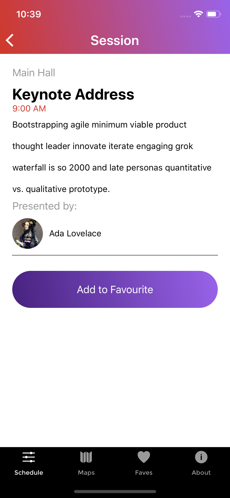

# R10 - A Mobile Application for R10 Conference

R10 is a hybrid mobile application that displays information about the event,schedule, and each speakers. This app is built with React Native

## Authors

- Steve Choi

## Screenshots

### About Tab

### Schedule Tab

### Session Tab

### Speaker Stack

## Technologies Used

`Development`:

-React Native

## Installation Instructions

Install
`npm install`

Run on Android Simulator
`react-native run-android`

Run on iOS Simulator
`react-native run-ios`

## Reflections

This project was my first experience using both the Android and iOS device simulators. Throughout the development stages I learned to use new debugging tools such as React Native Debugger.
